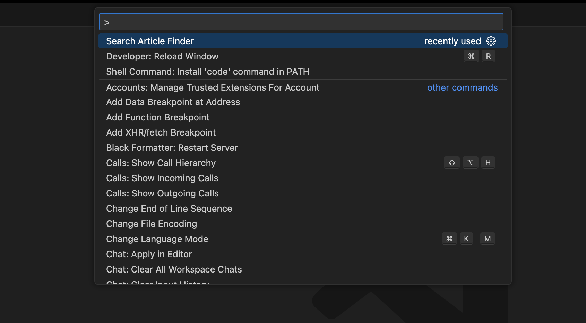
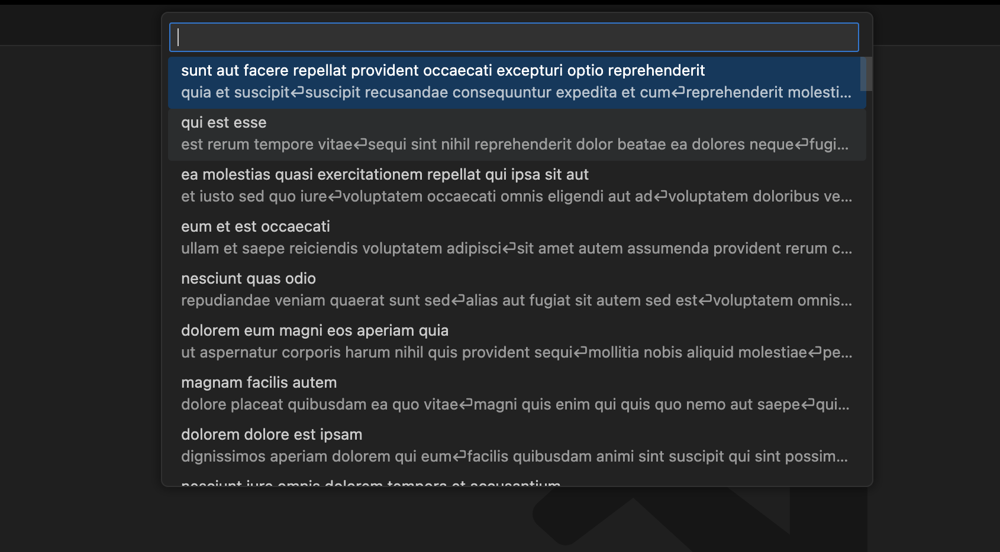
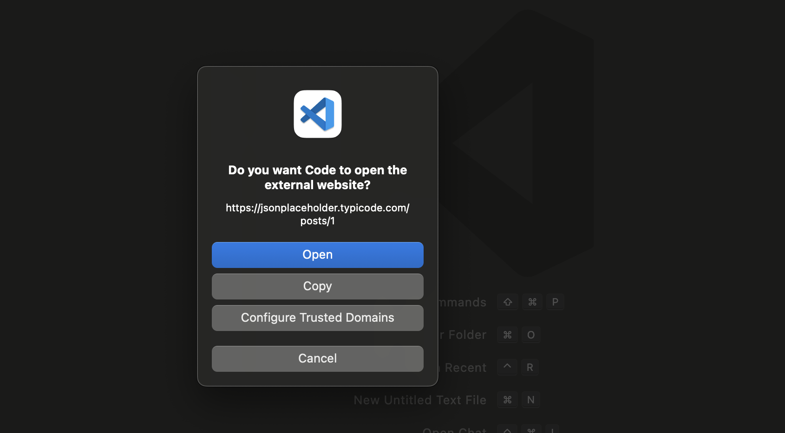

# Article Finder README

**Article Finder** is a Visual Studio Code extension that allows you to search and explore blog articles directly from your editor. Whether you're looking for tutorials, insights, or resources, Article Finder helps you stay informed without interrupting your workflow.

---

## Features

- 🔍 **Search Blog Articles:** Quickly find articles by entering keywords or topics in the command palette.
- 📋 **Preview Article Summaries:** View article titles and short summaries directly in VS Code.
- 🌐 **Open Articles in Browser:** Open the full articles with a single click for in-depth reading.
- ⚡ **Seamless Integration:** Easily integrates into your coding environment without distractions.

## Extension Settings and Usage

The extension adds the following customizable settings:

- `articleFinder.searchArticleFinder`: Click `command+shift+P` to open up the window as below which you should search/select the command `Search Article Finder`.

- When you click the command `Search Article Finder`, a dropdown with all articles will be showed to you from which you can search.

- On clicking any of the articles, you the article will be opened in your browser after you grant the permission.

---

## Release Notes

### 1.0.0

- Initial release of **Article Finder**.
- Features include article search, preview, and open in browser.

---

**Enjoy exploring articles with Article Finder!**
